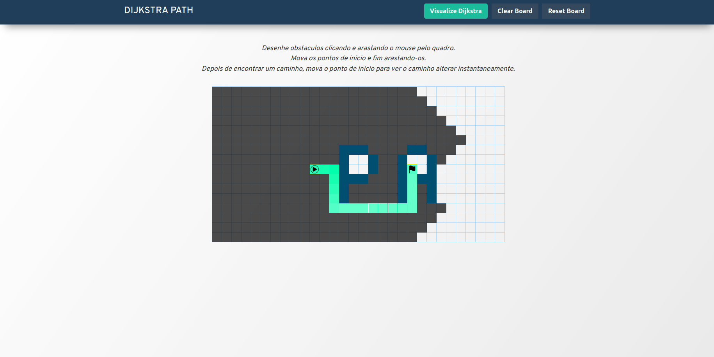

# Dijkstra Path

**Número da Lista**: X<br>
**Conteúdo da Disciplina**: Grafos 2<br>

## Alunos
|Matrícula | Aluno |
| -- | -- |
| 18/0113151  |  Eduardo Nunes Picolo |
| 14/0065547  |  Roberto Martins da Nóbrega |

## Sobre 
O projeto tem como objetivo encontrar o melhor caminho entre dois pontos em um campo com áreas bloqueadas escolhidas pelo usuário ao criar o quadro.

Ao iniciar a busca pelo caminho utilizando-se do algoritmo de busca de Dijkstra encontrase o destino e exibe em tela um dos menores caminhos possíveis.

Após essa obtenção pode-se adicionar outras barreiras ou mudar os pontos e origem e fim que o quadro se atualizará em tempo real.


## Screenshots





## Instalação 
**Linguagem**: JavaScript<br>
**Framework**: NextJs<br>

Precisa-se ter instalado o nodejs e o Yarn e dar os seguintes comandos:

```yarn install```

```yarn dev```


